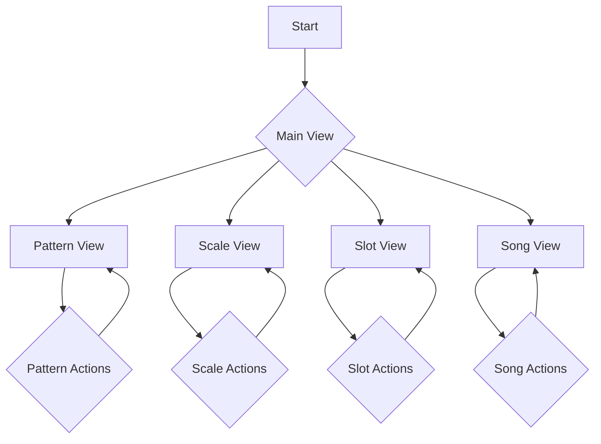
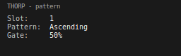
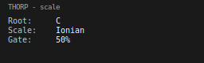
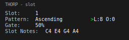
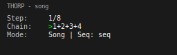

# **Thorp: A Lua-Based Sequencer Plugin**

Thorp is a powerful and intuitive Lua-based sequencer designed for creating complex musical patterns with ease. Its modular design and clear user interface make it an essential tool for both live performance and studio production.

---

## ✨ Features

*   **Intuitive Workflow:** A user-friendly interface that simplifies the creation of intricate sequences.
*   **Modular Design:** Separate views for managing patterns, scales, slots, and songs.
*   **Visual Feedback:** Clear visual representation of your musical structures.
*   **Flexible Sequencing:** Powerful tools for manipulating and arranging musical ideas.

---

## 🚀 Installation

1.  **Download:** Get the latest version of Thorp from the [releases page](https://github.com/your-username/thorp/releases).
2.  **Locate your scripts folder:** Find the Lua scripts folder for your host application.
3.  **Copy:** Move the `thorp.lua` file and the `thorp_ui` folder into your scripts directory.
4.  **Refresh:** Rescan your scripts in your host application, and Thorp will be available.

---

## 🎶 Usage

Once installed, you can load Thorp as a script in your host application. The main interface provides access to the four main views:

*   **Pattern View:** Create and edit your musical patterns.
*   **Scale View:** Define the musical scale for your patterns.
*   **Slot View:** Arrange your patterns into slots.
*   **Song View:** Sequence your slots to create a full song.

---

##  patching-guide

### Connecting to Instruments

Thorp sends MIDI data, so you'll need to connect it to a MIDI-compatible instrument or plugin. Here's a basic setup:

1.  **MIDI Out:** Set the MIDI output of the Thorp script to your desired instrument.
2.  **Channels:** Ensure the MIDI channel of Thorp matches the MIDI channel of your instrument.
3.  **Clock:** Sync Thorp to your host's clock for tight timing.

### Advanced Patching

*   **Modulation:** Use Thorp's CC outputs to modulate parameters on your synth.
*   **Polyrhythms:** Create complex rhythms by setting different pattern lengths.
*   **Layering:** Run multiple instances of Thorp to layer different sounds and patterns.

---

## 💡 Patch Performance Ideas

### Generative Melodies

*   **Scale Quantizing:** Use the scale view to lock your patterns to a specific key.
*   **Randomization:** Introduce subtle variations by using randomization features.
*   **Evolving Sequences:** Gradually build complexity by adding and removing notes over time.

### Live Performance

*   **Song Mode:** Arrange your patterns in song mode for a structured performance.
*   **Muting:** Use the mute function to bring elements in and out of the mix.
*   **On-the-Fly Editing:** Edit patterns in real-time to create dynamic changes.

---

## 📊 UI Flowchart

This flowchart illustrates the user interaction flow within the Thorp plugin:

---

## 🖼️ UI Pages

### Pattern View

### Scale View

### Slot View

### Song View

