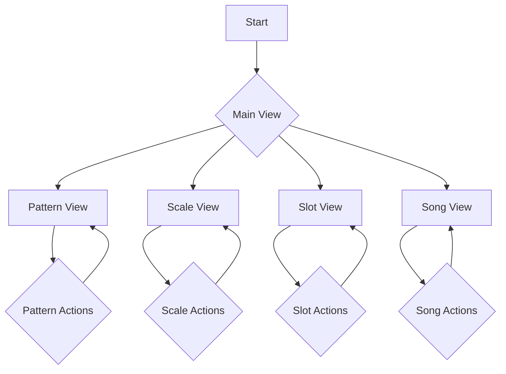

# **Thorp: A Lua-Based Sequencer Plugin**

Thorp is a powerful and intuitive Lua-based sequencer designed for creating complex musical patterns with ease. Its modular design and clear user interface make it an essential tool for both live performance and studio production.

---

## ✨ Features

*   **Intuitive Workflow:** A user-friendly interface that simplifies the creation of intricate sequences.
*   **Modular Design:** Separate views for managing patterns, scales, slots, and songs.
*   **Visual Feedback:** Clear visual representation of your musical structures.
*   **Flexible Sequencing:** Powerful tools for manipulating and arranging musical ideas.

---

## 🚀 Installation

1.  **Download:** Get the latest version of Thorp from the [releases page](https://github.com/your-username/thorp/releases).
2.  **Locate your scripts folder:** Find the Lua scripts folder for your host application.
3.  **Copy:** Move the `thorp.lua` file and the `thorp_ui` folder into your scripts directory.
4.  **Refresh:** Rescan your scripts in your host application, and Thorp will be available.

---

## 🎶 Workflow

Thorp's workflow is centered around four main pages: **Slot**, **Pattern**, **Scale**, and **Song**. The general idea is to configure arpeggio slots with patterns and notes, and then sequence those slots in the Song page. Arpeggios are driven by MIDI note input, which can be latched and saved to slots.

### MIDI Input and Latching

Arpeggios are initially driven by MIDI note input. When you play notes on your MIDI controller, they are added to a temporary buffer. These "latched" notes are used to generate arpeggios in real-time. You can then save these latched notes to a specific slot for later use.

### Page 1: Slot

The **Slot** page is where you manage the 16 arpeggiator slots. Each slot can hold a set of notes, a pattern, and other parameters.

**Step-by-step guide:**

1.  **Select a Slot:** Use **Encoder 1** to choose one of the 16 available slots.
2.  **Latch Notes:** Play some notes on your MIDI controller. These notes will be latched and used for the arpeggio.
3.  **Save Latched Notes:** Press **Pot 2** to save the latched notes to the selected slot.
4.  **Adjust Length and Offset:** Use **Encoder 2** to adjust the length and offset of the arpeggio. Press **Encoder 2** to toggle between length and offset mode.
5.  **Adjust Gate Length:** Use **Pot 3** to change the gate length of the arpeggio.

### Page 2: Pattern

The **Pattern** page is where you work with rhythmic and velocity patterns, plus gate probability.

**Step-by-step guide:**

- **Length and Offset:** Use **Encoder 2** to adjust the length and offset of the arpeggio. Press **Encoder 2** to toggle between length and offset mode.
+**Length (Immediate in Jam Mode) & Offset:** In Jam mode, changes to Length are applied instantly to the running arpeggio thanks to the new immediate update feature. Use **Encoder 2** to adjust Length or Offset; press **Encoder 2** again to switch between the two modes.
1.  **Select Rhythm Pattern:** Use **Encoder 1** to choose a rhythmic pattern from the list.
2.  **Select Velocity Pattern:** Use **Encoder 2** to choose a velocity pattern from the list.
3.  **Adjust Gate Probability:** Use **Pot 1** to set the probability (0-100%) that each step's gate will fire.
4.  **Assign Both Patterns:** Press **Pot 2** to save both rhythm and velocity patterns to the current slot.
5.  **Adjust Gate Length:** Use **Pot 3** to change the gate length of the arpeggio.

### Page 3: Scale

The **Scale** page is where you set musical scales and configure octave jump behavior.

**Step-by-step guide:**

1.  **Select Root Note:** Use **Encoder 1** to choose the root note of the scale.
2.  **Select Scale:** Use **Encoder 2** to choose a scale from the list.
3.  **Adjust Octave Jump Chance:** Use **Pot 1** to set the probability (0-100%) of octave jumps occurring.
4.  **Adjust Octave Jump Range:** Use **Pot 2** to set the range (±1-3 octaves) of octave jumps.
5.  **Adjust Gate Length:** Use **Pot 3** to change the gate length of the arpeggio.

### Page 4: Song

The **Song** page is where you can chain together your arpeggio slots to create a song.

**Step-by-step guide:**

1.  **Add Slot to Chain:** Use **Encoder 1** to select a slot, then press **Encoder 1** to add it to the song chain.
2.  **Select Play Position:** Use **Encoder 2** to move the playback cursor within the chain.
3.  **Remove Slot from Chain:** Press **Encoder 2** to remove the slot at the current playback position.
4.  **Cycle Play Mode:** Press **Pot 2** to cycle through the play modes: **Off**, **Jam** (plays the currently latched notes), and **Song** (plays the song chain).
5.  **Select Sequence Mode:** Use **Pot 3** to choose a sequence mode for song playback: **Seq**, **Ping-Pong**, **Rnd-Walk**, or **Random**.

---

##  patching-guide

### Connecting to Instruments

Thorp sends CV (Control Voltage) data for pitch and gate, so you'll need to connect it to a CV-compatible instrument or module. Here's a basic setup:

1.  **CV Out:** Connect the Gate, V/Oct, and Velocity outputs of Thorp to your desired instrument.
2.  **MIDI In:** Ensure the MIDI channel of your controller matches the MIDI channel of Thorp.
3.  **Clock:** Sync Thorp to your host's clock for tight timing.

### Advanced Patching

*   **Modulation:** Use Thorp's CC outputs to modulate parameters on your synth.
*   **Polyrhythms:** Create complex rhythms by setting different pattern lengths.
*   **Layering:** Run multiple instances of Thorp to layer different sounds and patterns.

---

## 💡 Patch Performance Ideas

### Generative Melodies

*   **Scale Quantizing:** Use the scale view to lock your patterns to a specific key.
*   **Randomization:** Introduce subtle variations by using randomization features.
*   **Evolving Sequences:** Gradually build complexity by adding and removing notes over time.

### Live Performance

*   **Song Mode:** Arrange your patterns in song mode for a structured performance.
*   **Muting:** Use the mute function to bring elements in and out of the mix.
*   **On-the-Fly Editing:** Edit patterns in real-time to create dynamic changes.

---

## 📊 UI Flowchart

This flowchart illustrates the user interaction flow within the Thorp plugin:

---

## 🖼️ UI Pages

### Pattern View

### Scale View

### Slot View

### Song View

