```mermaid
graph TD
    subgraph Global Controls
        A[Any Page] -- Button 1 Push (- Page) --> PageSwitch
        A -- Button 4 Push (+ Page) --> PageSwitch
        A -- Button 3 Push (Help) --> ToggleHelp
        A -- Button 2 Push (Exit) --> ExitApp
        ToggleHelp -- Toggles --> HelpScreen[Help Screen Visible]
        PageSwitch -- Cycles through --> SlotPage
        PageSwitch -- Cycles through --> PatternPage
        PageSwitch -- Cycles through --> ScalePage
        PageSwitch -- Cycles through --> SongPage
    end

    subgraph MIDI Input
        MIDIIn[MIDI Note On/Off] --> LatchNotes{Latch Notes}
        LatchNotes -- In Jam Mode --> Arpeggiate
        LatchNotes -- Can be saved --> SlotPage
    end

    subgraph Page: Slot
        SlotPage -- Encoder 1 Turn --> SelectArpSlot
        SlotPage -- Encoder 1 Push --> AddSlotToChain
        SlotPage -- Encoder 2 Push --> ToggleLengthOffset
        SlotPage -- Encoder 2 Turn (Length Mode) --> AdjustLength
        SlotPage -- Encoder 2 Turn (Offset Mode) --> AdjustOffset
        SlotPage -- Pot 2 Push --> SaveLatchedNotes
        SlotPage -- Pot 3 Turn --> AdjustGateLength
    end

    subgraph Page: Pattern
        PatternPage -- Pot 1 Turn --> AdjustGateProbability
        PatternPage -- Encoder 1 Turn --> SelectRhythmPattern
        PatternPage -- Encoder 2 Turn --> SelectVelocityPattern
        PatternPage -- Pot 2 Push --> AssignBothPatternsToSlot
        PatternPage -- Pot 3 Turn --> AdjustGateLength
    end

    subgraph Page: Scale
        ScalePage -- Encoder 1 Turn --> SelectRootNote
        ScalePage -- Encoder 2 Turn --> SelectScale
        ScalePage -- Pot 1 Turn --> AdjustOctaveJumpChance
        ScalePage -- Pot 2 Turn --> AdjustOctaveJumpRange
        ScalePage -- Pot 3 Turn --> AdjustGateLength
    end

    subgraph Page: Song
        SongPage -- Encoder 1 Turn --> SelectSlotToAdd
        SongPage -- Encoder 1 Push --> AddSlotToChain
        SongPage -- Encoder 2 Turn --> SelectPlayPosition
        SongPage -- Encoder 2 Push --> RemoveSlotFromChain
        SongPage -- Pot 2 Push --> CyclePlayMode
        SongPage -- Pot 3 Turn --> SelectSequenceMode
    end

    subgraph Arpeggiator
        Arpeggiate -- Plays notes --> CVOut[CV Pitch/Gate Out]
    end

    style HelpScreen fill:#f9f,stroke:#333,stroke-width:2px
    style ExitApp fill:#f00,stroke:#333,stroke-width:2px
```

## UI Flowchart Explanation

This flowchart details the user interface logic for the Thorp Arpeggiator. The UI is organized into four main pages, with global controls for navigation and help.

### Global Controls

These controls are accessible from any of the four main pages.

-   **Button 1 (- Page):** Cycles to the *previous* page in the order: (Song -> Scale -> Pattern -> Slot -> Song).
-   **Button 4 (+ Page):** Cycles to the *next* page in the order: (Slot -> Pattern -> Scale -> Song -> Slot).
-   **Button 3 (Help):** Toggles the visibility of the on-screen help menu, which displays the function of each control for the current page.
-   **Button 2 (Exit):** Exits the plugin's UI.

---

### MIDI Input

-   **MIDI Note On/Off:** When a MIDI note is received, it is added to a temporary "latch" buffer.
-   **Latch Notes:** In **Jam Mode**, the latched notes are immediately used by the arpeggiator. These notes can also be saved to a slot from the **Slot Page**.

---

### Page 1: Slot

This page is for configuring the 16 arpeggiator slots.

-   **Encoder 1 Turn (Select Slot):** Selects the active arp slot (1-16).
-   **Encoder 1 Push (Add to Chain):** Adds the currently selected slot to the end of the song chain.
-   **Encoder 2 Push (Toggle L/O):** Toggles the function of Encoder 2 between adjusting the arpeggio `Length` and `Offset`.
-   **Encoder 2 Turn (Adjust L/O):** Adjusts the `Length` or `Offset` of the arpeggio for the current slot, depending on the mode set by the push action.
-   **Pot 2 Push (Save Notes):** Saves any currently latched MIDI notes to the selected slot.
-   **Pot 3 Turn (Gate Length):** Adjusts the gate length for all notes played by the arpeggiator.

---

### Page 2: Pattern

Assigns rhythmic and velocity patterns, plus configures gate probability.

-   **Pot 1 Turn (Gate Probability):** Sets the probability (0-100%) that each step's gate will fire.
-   **Encoder 1 Turn (Rhythm Pattern):** Selects a rhythmic pattern from the internal list.
-   **Encoder 2 Turn (Velocity Pattern):** Selects a velocity pattern from the internal list.
-   **Pot 2 Push (Assign Both):** Assigns both rhythm and velocity patterns to the current arp slot.
-   **Pot 3 Turn (Gate Length):** Adjusts the gate length.

---

### Page 3: Scale

Sets the musical scale and configures octave jump behavior.

-   **Encoder 1 Turn (Select Root):** Selects the root note of the scale (C, C#, D, etc.).
-   **Encoder 2 Turn (Select Scale):** Selects a musical scale from the internal list (Ionian, Dorian, etc.).
-   **Pot 1 Turn (Octave Jump Chance):** Sets the probability (0-100%) of octave jumps occurring.
-   **Pot 2 Turn (Octave Jump Range):** Sets the range (±1-3 octaves) of octave jumps.
-   **Pot 3 Turn (Gate Length):** Adjusts the gate length.

---

### Page 4: Song

Creates and manages the song chain.

-   **Encoder 1 Turn (Select Slot to Add):** Selects an arp slot (1-16).
-   **Encoder 1 Push (Add to Chain):** Adds the selected slot to the end of the song chain.
-   **Encoder 2 Turn (Select Position):** Moves the playback cursor within the song chain.
-   **Encoder 2 Push (Remove from Chain):** Removes the slot at the current playback position from the chain.
-   **Pot 2 Push (Cycle Play Mode):** Cycles through the main play modes: `Off`, `Jam` (live play), and `Song` (plays the chain).
-   **Pot 3 Turn (Select Seq Mode):** Selects the sequence mode for song playback: `Seq`, `Ping-Pong`, `Rnd-Walk`, or `Random`.